Sylvan LE DEUNFF

# Projet Traitement et Analyse d’Images
# IMR3 – 2019-2020
# Classification d’images


Aujourd'hui la croissance du numérique, et le développement des services Cloud amènent une explosion du nombre de documents multimédias à stocker. En particulier les images qui sont omniprésentes sur les réseaux sociaux comme Facebook, Instagram ou Snapchat. Pour pouvoir rechercher ces images ou en extraire de l'information, on peut utiliser des métadonnées, mais celles-ci sont bien souvent incomplètes ou erronnées. Il devient donc nécessaire de pouvoir classifier ces images non-plus selon leur métadonnées, mais en se basant sur leur contenu.

Pour ce TP, nous nous intéressons à une problématique de classification d'images. L'objectif ici est donc d'être en mesure d'attribuer une étiquette (classe) à une image à partir de son contenu. Pour cela nous comparerons 2 approches :

- la classification basée sur des vecteurs de distances entre les primitives de l'image.
- la classification par un réseau de neurones convolutif.

# Utilisation

## Installation des pré-requis

* installer python3
* cloner le projet git / ou le telecharger
* puis à la racine du projet :

```bash
# créer un environnement virtuel (évite les conflits avec des libs existantes)
virtualenv venv -p python3

# activer l'environnement (linux)
source env/bin/activate
# OU sous windows: 
\venv\Scripts\activate.bat

# installer les dépendances du projet
pip install -r requirements
```

Pour la partie 3 (CNN), un outil en ligne de commande a été développé. Qui s'utilise de la manière suivante :

- récupérer la liste des commandes disponibles

```bash
# python -m src --help
usage: __main__.py [-h] {create-database,train-cnn,cnn-classify} ...

positional arguments:
  {create-database,train-cnn,cnn-classify}

optional arguments:
  -h, --help            show this help message and exit
```

- Créer la base de données au format train / validation / test avec les classes séparées dans des sous-répertoires.

```bash
# python -m src create-database --help
usage: __main__.py create-database [-h] [--classes [CLASSES [CLASSES ...]]]
                                   --from FROM

optional arguments:
  -h, --help            show this help message and exit
  --classes [CLASSES [CLASSES ...]]
                        (optional) specify classes to select in source folder
  --from FROM           path to the source folder (here coreldb)
```

- Entrainer le CNN sur les ensembles de test / validation générés précédemment

```bash
# python -m src train-cnn --help
usage: __main__.py train-cnn [-h] [-b BATCH_SIZE] [-e EPOCHS] [--history]

optional arguments:
  -h, --help            show this help message and exit
  -b BATCH_SIZE, --batch_size BATCH_SIZE
                        batch size
  -e EPOCHS, --epochs EPOCHS
                        epochs
  --history             plot training history
```

- Test le CNN sur l'ensemble de test généré précédemment

```bash
# python -m src cnn-classify --help
usage: __main__.py cnn-classify [-h] [--confusion]

optional arguments:
  -h, --help   show this help message and exit
  --confusion  plot confusion matrix after testing
```

# Explications
## Préparation des données

Ici les images étudiées proviennent de la base de données Corel. C'est un ensemble d'image provenant d'une galerie photo de même nom, qui ont été labellisés et rangées dans des répertoires portant les noms de ces étiquettes.

*Exemple de structure de la BDD*
```
coreldb
├── ...
├── pet_cat
└── pet_dog
```

### Répartition des données en 3 sous-ensembles

Avant de nous attaquer à un problème de classification d'images, il convient pour chaque feature de répartir les données en 3 sous-ensembles. A savoir :

* **apprentissage**: ce sont les données qui seront utilisées pour entraîner notre modèle.

* **validation**: les données de cet ensemble ne sont pas utilisées lors de l'apprentissage. elles permettront d'ajuster les hyper-paramètres du modèle.

* **test**: ces données servent à évaluer la précision d'un modèle *après entrainement*. Il est essentiel qu'elles n'aient pas servi pendant les phases d'apprentissage ou de test. Dans le cas contraire, on risque de sur-entrainer notre modèle qui ne fera plus à proprement parler des "prédictions" mais de la mémorisation.

Nous commencons donc par ajouter une méthode statique à notre classe `Database.create`, qui crée une nouvelle base de donénes ou les images labellisées sont réparties en 3 sous-ensembles (test, validation, train). 
- Elle prend en paramètre le nom du répertoire où sont localisées les images labellisées (paramètre `from_folder`).
- La répartition des images dans les ensembles train, validation et tests peut être controlée en passant un 3-uplet au paramètre `ratio`.
- Par défaut, 3 fichiers CSV sont créés, qui contiennent l'association `<chemin vers image>/<classe de l'image>`.
- Par défaut, les classes à extraire de la base source sont choisies aléatoires. Il est possible d'en spécifier la liste via le paramètre `classes`.

```python
class Database:
    """
    Helper to create and interract with database.
    """

    @classmethod
    def _generate_labels_file(cls, database_path, subfolder):
        """
        Create a CSV file wich associate image path and its class.

        Parameters:
            - subfolder: string in (train, test, validation)
        """
        database_subfolder = os.path.join(database_path, subfolder)
        labels_file = os.path.join(database_path, subfolder + '_labels.csv')

        if os.path.exists(labels_file):
            return
        
        with open(labels_file, 'w', encoding='UTF-8') as f:
            f.write("img,cls")
            for root, _, files in os.walk(database_subfolder, topdown=False):
                classe = os.path.split(root)[-1]

                for name in files:
                    if name[:-4] in ('.jpg', '.png'):
                        continue
                
                    img = os.path.join(root, name)
                    f.write("\n{},{}".format(img, classe))
    
    @classmethod
    def random_classes(cls, from_folder):
        """
        Return a set of 2-8 classes randomly picked in <from_folder>.
        """
        n = randint(2, 8)
        # recupere la liste de toutes les classes dans un ordre aleatoire
        all_classes = sorted(os.listdir(from_folder), key=lambda x: random())
        # renvoie les n premiers resultats
        return all_classes[:n]
        

    @classmethod
    def create(cls, database_name, from_folder, classes=None, ratios=(0.7, 0.15, 0.15), csv_labels=True):
        """
        Create a new database with train, validation and test subfolders.

        Parameters:
            - database_name: name of the folder to be created.
            - from_folder: another folder containing images labelized in subfolders.
            - ratios: proportion of respectively train, validation and test subsets.
            - classes: list of classes that will be extracted from original folder
                if not specified, a set of 2-8 classes will be randomly picked.
        """
        assert sum(ratios) == 1, "Sum of ratios must be equal to 1!"

        # supprime une base de données de même nom qui pourrait exister
        shutil.rmtree(database_name, ignore_errors=True)

        # si aucune classe n'est passée en paramètre, en choisi aléatoirement
        if not classes:
            classes = cls.random_classes(from_folder)
        
        for classe in classes:
            origin_class_path = os.path.join(from_folder, classe)
            # recupere la liste des images de cette classe dans un ordre aleatoire
            class_images = sorted(os.listdir(origin_class_path), key=lambda x: random())
            # 
            n = len(class_images)
            slices = (0, int(n*ratios[0]), int(n*(ratios[0]+ratios[1])), n)

            subfolders = ('train', 'validation', 'test')
            for k in range(3):
                # crée au fur et a mesure l'arborescence de la nouvelle base de données
                dest_folder = os.path.join(database_name, subfolders[k], classe)
                os.makedirs(dest_folder)
                # copie un sous ensemble des images dans le repertoire
                for image in class_images[slices[k]: slices[k+1]]:
                    shutil.copy(
                        os.path.join(origin_class_path, image),
                        os.path.join(dest_folder, image)
                    )

        if csv_labels:
            cls._generate_labels_file(database_name, 'train')
            cls._generate_labels_file(database_name, 'validation')
            cls._generate_labels_file(database_name, 'test')

```

Exemple d'utilisation

On crée une base avec 2 classes (chien / chat)

```python
Database.create(
    'database', 
    from_folder='coreldb', 
    classes=['pet_cat', 'pet_dog'],
    labels=True
)
```

Après exécution de ce script la base de travail générée est la suivante.

```
database/
├── test_labels.csv
├── train_labels.csv
├── validation_labels.csv
|
├── test
│   ├── pet_cat
│   └── pet_dog
├── train
│   ├── pet_cat
│   └── pet_dog
└── validation
     ├── pet_cat
     └── pet_dog
```

## Classification d'images basée sur leurs attributs (CBIR)

Nous allons à présent chercher à classifier des images en fonctions de leurs attributs. Pour cela nous nous appuyons sur la librairie suivante suivante :

https://github.com/pochih/CBIR/

Elle permet en temps normal d'effectuer des requêtes pour extraire les images les plus proches (selon les vecteurs d'attribut) d'une image d'entrée.

Il faut donc modifier le code afin d'extraire les attributs des images d'un jeu d'entrainement. Puis il faut utiliser les résultats de cette extraction afin de prédire les classes d'un ensemble de test.

Ici j'ai implémenté la classification par couleur (color.py), et par bordure (edge.py),

### Classification par couleur

Voici quelques échantillons obtenus avec la classification par couleur.

| Classe  | Images prédites                  |                                  |                                  |                                  |     |
| ------- | -------------------------------- | -------------------------------- | -------------------------------- | -------------------------------- | --- |
| pet_cat |  |  |  |  |
| pet_dog |  | 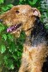 | 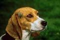 |  |

### Classification par détection de bordure

Voici quelques échantillons obtenus avec la classification par bordure

| Classe  | Images prédites                 |                                 |                                 |                                 |     |
| ------- | ------------------------------- | ------------------------------- | ------------------------------- | ------------------------------- | --- |
| pet_cat | 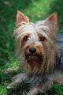 | 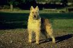 |  |  |
| pet_dog |  | 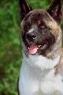 |  |  |

### Classification par fusion

Voici quelques échantillons obtenus avec la classification par fusion (couleur + bordure)

| Classe  | Images prédites                   |                                   |                                   |                                   |     |
| ------- | --------------------------------- | --------------------------------- | --------------------------------- | --------------------------------- | --- |
| pet_cat |  |  |  |  |
| pet_dog |  |  | 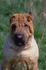 | 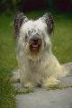 |


## Classification par un CNN

Un réseau de neurones convolutif (CNN) est un algorithme d'apprentissage profond qui peut prendre une image d'entrée, attribuer une importance à divers aspects/objets de l'image et être capable de les différencier les uns des autres. Le prétraitement requis dans un CNN est beaucoup moins important que dans d'autres algorithmes de classification. En effet les méthodes basées sur l'analyse des primitives comme le CBIR, nécessitent de concevoir les filtres à la main, ce qui demande des connaissances d'expertise. A l'inverse, les CNN ont la capacité d'apprendre "naturellement" ces filtres/caractéristiques.

L'architecture d'un CNN est analogue à celle du schéma de connectivité des neurones dans le cerveau humain et s'inspire de l'organisation du cortex visuel. Les neurones individuels répondent aux stimuli que dans une région restreinte du champ visuel appelée le champ de réception. Un ensemble de ces champs se chevauchent pour couvrir la totalité de la zone visuelle.


### Structure du CNN utilisé

#### Principe des CNN

Les images ont la forme d'une matrice de pixels de taille largeur*hauteur*canaux. Ici, nous utilisons trois canaux : rouge, vert, bleu, c'est pourquoi nous avons une profondeur de 3.

La couche convolutive utilise un ensemble de filtres appris avec l'entraînement. Un filtre est utilisé pour détecter la présence de caractéristiques ou de motifs spécifiques présents dans l'image originale (entrée).  Il est généralement exprimé sous forme de matrice, avec une dimension plus petite mais la même profondeur que le fichier d'entrée.

Une convolution est alors appliqué. Le filtre parcours la largeur et la hauteur du fichier d'entrée, et un produit de points est calculé pour donner une carte d'activation. Ici nous utilisons des fonctions d'activations de type relu (Rectifier Linear Unit). Elle permettent un entrainement rapide et efficace sur de larges jeux de données.

Les données résultantes sont ensuite transmises à travers une couche de pooling. Sa fonction est de réduire progressivement la taille de la représentation pour réduire la quantité de paramètres et de calculs dans le réseau. Ici nous utiliserons des couches de type MaxPooling de taille (2,2).

*Schéma illustrant le principe du max pooling*


#### Implémentation

On défini une classe qui hérite du classifieur

```python
class CNNClassifier(Sequential):
    """
    Simple convolutional network classifier with methods to interract
    with a local image database.
    """

    def __init__(self, n_output, target_size=(150, 150)):
        super(Sequential, self).__init__()
        self.target_size = target_size

        self.add(Conv2D(32, (3, 3), input_shape=(*target_size, 3)))
        self.add(Activation('relu'))
        self.add(MaxPooling2D(pool_size=(2, 2)))

        self.add(Conv2D(32, (3, 3)))
        self.add(Activation('relu'))
        self.add(MaxPooling2D(pool_size=(2, 2)))

        self.add(Conv2D(64, (3, 3)))
        self.add(Activation('relu'))
        self.add(MaxPooling2D(pool_size=(2, 2)))

        # the model so far outputs 3D feature maps (height, width, features)
        self.add(Flatten())  # this converts our 3D feature maps to 1D feature vectors
        self.add(Dense(64))
        self.add(Activation('relu'))
        self.add(Dropout(0.5))
        self.add(Dense(n_output))
        self.add(Activation('softmax'))

        self.compile(
            loss='sparse_categorical_crossentropy',
            optimizer='adam',
            metrics=['accuracy']
        )
```

### Entrainement du modèle

#### Paramètres de l'apprentissage

- Le paramètre **batch_size** est un hyperparamètre qui définit le nombre d'échantillons à traiter avant de mettre à jour les paramètres du modèle interne. Après traitement d'un lot (batch), les prédictions sont comparées aux variables de sortie attendues et une erreur est calculée. À partir de cette erreur, l'algorithme de mise à jour est utilisé pour améliorer le modèle, par exemple en se déplaçant vers le bas le long du gradient d'erreur. Son maximum est le nombre de tous les échantillons, ce qui rend la descente de gradient précise, la perte diminuera vers le minimum si le taux d'apprentissage est assez faible, mais les itérations sont plus lentes. Son minimum est de 1, ce qui entraîne une descente stochastique du gradient : Rapide mais la direction du pas du gradient n'est basée que sur un seul exemple, le loss peut donc ne pas converger.

- Le nombre d'**epochs** est un hyperparamètre qui définit le nombre de fois que l'algorithme d'apprentissage va travailler sur l'ensemble des données d'entrainement. Dans un epoch chaque échantillon de l'ensemble de données d'apprentissage a eu l'occasion de mettre à jour les paramètres internes du modèle. Un epoch est composée d'un ou plusieurs batch(s). Il est courant de créer des tracés linéaires de l'accuracy et du loss en fonction du nombre d'epochs. Ces tracés (courbes d'apprentissage) peuvent aider à diagnostiquer si le modèle a sur-appris, sous-appris, ou s'il est convenablement adapté à l'ensemble de données d'apprentissage.

#### Implémentation d'une méthode d'apprentissage

Cette méthode prend en paramètre une taille de lot (batch_size) et un nombre d'epochs.
On peut également passer le paramètre `history` à true pour afficher l'évolution des métriques
au cours de l'apprentissage en fonction du nombre d'epochs.

L'exécution de la méthode a pour effet d'entrainer le modèle et de sauvegarder les poids appris dans un fichier `<database>/model_weight.h5`. Si le fichier existe déja, les poids sont chargés et l'apprentissage n'a pas lieu, excepté si le paramètre `overwrite` est passé à `True`.

```python
class CNNClassifier(Sequential):

    ...

    def train(self, database, batch_size=16, epochs=15, history=False, overwrite=False):
        """
        Train model on test subfolder of database

        Parameters:
            - database: database object defined in this library.
            - overwrite: allow to overwrite existing training data.
            - history: if set to true, plot the evolution of metrics over epochs.
        """

        # si le modele a deja ete entraine, charge les poids existants
        # sauf si l'utilisateur demande explicitement de l'ecraser
        if database.weights_exists and not overwrite:
            self.load_weights(database.weights_filename)
            print('Weights already existing, skipping training step.')
            return
        
        train_images = database.get_images_generator('train')
        validation_images = database.get_images_generator('validation')

        # entraine le modele en utilisant les images de train et validation
        train_history = self.fit(
            train_images,
            epochs=epochs,
            validation_data=validation_images
        )

        # sauvegarde les poids du modele pour pouvoir les reutiliser plus tard
        self.save_weights(database.weights_filename)

        if history:
            self.plot_history(train_history)
```

#### Résultats de l'entrainement

Après entrainement

```python
n = len(database) # ici 2 --> {cat, dog}
model = CNNClassifier(2)
model.train(database, batch_size=16, epochs=15, history=False, overwrite=False)
```

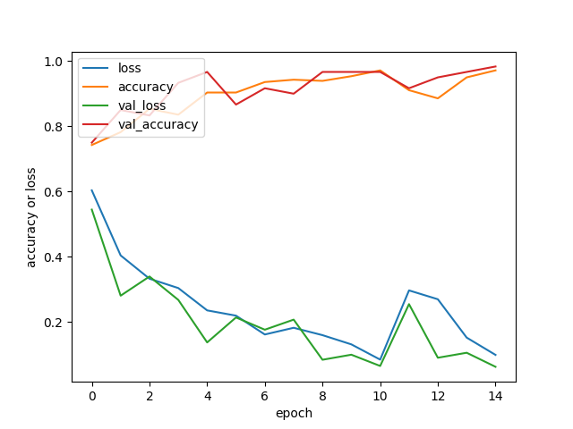

Suite à la lecture du graphe précédent, on remarque qu'il y a probablement overfitting à partir de 10 epochs.

On relance donc un nouvel entrainement en réduisant le nombre d'epochs.

```python
n = len(database) # ici 2 --> {cat, dog}
model = CNNClassifier(2)
model.train(database, batch_size=16, epochs=10, history=False, overwrite=False)
```
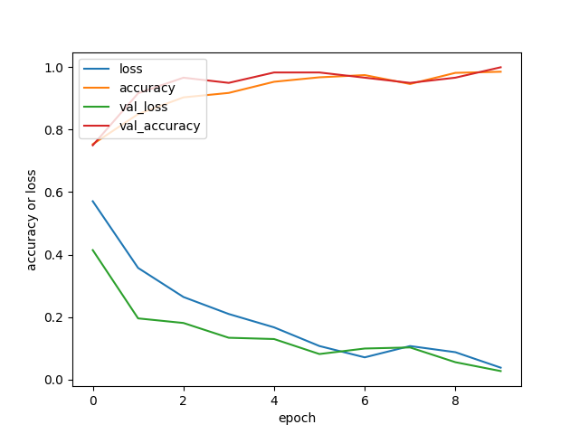

### Prédictions et évaluations

#### Implémentation de la classification d'images

On défini à notre modèle une méthode classify_test_images. Son rôle est de chargé les images labellisées de la base de test, puis de les classer dans le répertoire `<database>/results`. Le paramètre `separate_miss` permet d'écrire également les prédictions dans le répertoire `<database>/miss`. Cela permet d'aller consulter les erreurs de prédictions et de juger de l'acceptabilité de ces erreurs.


```python
class CNNClassifier(Sequential):

    ...

    def classify_test_images(self, database, confusion_matrix=False, separate_miss=True):
        """
        Use trained model to predict classes of images in test/ folder.
        Output theses images in a folder called predictions/
        Parameter:
            - database: neural_network.Database object.
            - separate_miss: if true, create a miss folder to store failed predictions.
            - confusion_matrix: if true, plot a confusion matrix showing classfication accuracy.
        """

        # charge la liste des images dans le jeu de test et leurs labels
        test_images = database.get_images_generator('test', shuffle=False)

        # cree un (ou deux) repertoire(s) vides pour stocker les predictions de la classification
        database.reset_output(miss=separate_miss)

        # predit les labels des images du jeu de test
        predictions = argmax(self.predict(test_images), axis=1).numpy()
        classes = database.classes

        for k in range(len(predictions)):
            classe = classes[predictions[k]]
            true_classe, filename = test_images.filenames[k].split('/')

            # copie toutes images dans le repertoire results/<classe predite>
            shutil.copy(
                os.path.join(database.path, 'test', test_images.filenames[k]),
                os.path.join(database.path, 'results', classe, filename)
            )
            if separate_miss and true_classe != classe:
                # copie les echecs de predictions dans le rep. miss/<classe predite>
                # permet d'analyser les faux positifs
                shutil.copy(
                    os.path.join(database.path, 'test', test_images.filenames[k]),
                    os.path.join(database.path, 'miss', classe, filename)
                )

        # si demande, affiche la matrice de confusion des predictions
        if confusion_matrix:
            self.confusion_matrix(test_images.classes, predictions, labels=database.classes)
        
        
    def confusion_matrix(self, y_true, y_pred, labels=None):
        """
        Plot confusion matrix using matplotlib and sklearn.
        """
        cmatrix = confusion_matrix(y_true, y_pred, normalize='true')
        display = ConfusionMatrixDisplay(confusion_matrix=cmatrix, display_labels=labels)
        display.plot()
        plt.show()
```


#### Analyse de quelques exemples


#### Quelques exemples

La plupart des images étant classifiées correctement, nous nous intéresserons uniquement aux *faux positifs* et aux *faux négatifs*.

##### Chat VS Chiens

* Matrice de confusion des prédictions

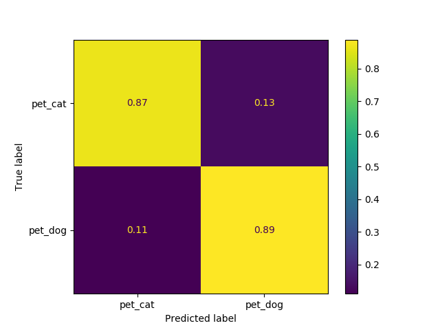

On constate que le modèle fourni des résultats satisfaisant. En effet, il est capable de reconnaitre un chat d'un chien dans environ 90% des cas et commet une erreur dans un peu plus de 10% des cas.

* Images classifiés à tort comme étant des chats

|  |  | 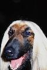 |
| ------------------------- | ------------------------- | ------------------------- |

* Images classifiés à tort comme étant des chiens

|  |  |
| ------------------------- | ------------------------- |

##### Bonsai VS Doll VS Mask VS Cat VS Cougar

* Matrice de confusion des prédictions

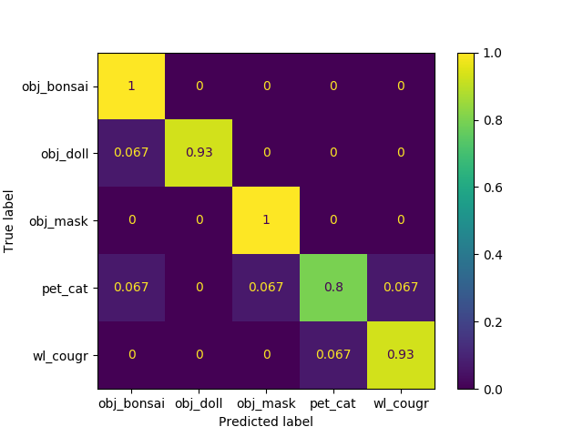

Ici les prédictions sont très bonnes. Comme on aurait pu s'y attendre, le chat est parfois confondu avec le cougar. On explique plus difficilement la confusion entre le chat et le bonsai ou la poupée. L'analyse des erreurs de prédictions nous en apprendra davantage.

* Images classifiées à tort comme étant des chats

| 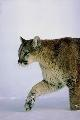 |     |
| -------------------------- | --- |

* Images classifiées à tort comme étant des cougars

| 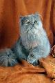 |     |
| ----------------------------- | --- |

* Images classifiées à tort comme étant des bonsais

|  | 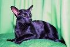 |
| ----------------------------- | ----------------------------- |

* Image classifiée à tort comme étant un masque

|  |     |
| --------------------------- | --- |

* Images classifiées à tort comme étant des poupées

**Aucune !**

## Conclusion

La classification à vecteurs d'attributs très utilisée par le passée donne des résultats satisfaisants mais requiert des connaissances spécifiques à chaque vecteur d'attribut calculé. Elle demande donc une certaine expertise.

La classification par un CNN est plus simple à mettre en oeuvre grâce à l'existence de librairies comme tensorflow, keras, sklearn... Elle donne de meilleurs résultats et nécessite moins d'expertise. Inconvénient: l'entrainement est plus long.

Aujourd'hui, on peut trouver sur le net des architectures hybrides. Par exemple des CNN dont certaines couches (implémentés manuellement) font de la classification à vecteur d'attribut. Il semblerait que cette solution, utilisé à bon escient, donne la classification la plus satisfaisante.
