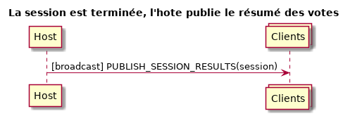

> Simple poker planning app using Kotlin, databinding, and TCP/multicast sockets.

## Download release

### Multicast version
[multicast APK](../raw/master/releases/pokerplanning-multicast.apk)

[multicast AAB](../raw/master/releases/pokerplanning-multicast.aab)

### Broadcast version
[broadcast APK](../raw/master/releases/pokerplanning-broadcast.apk)

[broadcast AAB](../raw/master/releases/pokerplanning-broadcast.aab)

## Data class diagram

## Network communication

### Sessions discovery

### Join session

### Votes

### Summary

