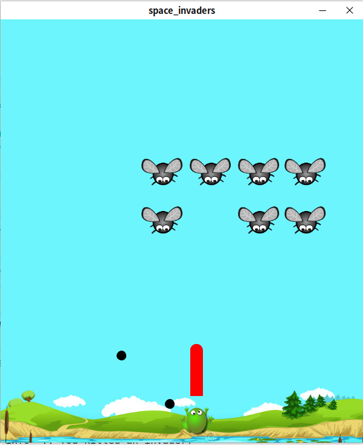

---

layout: project

title: Space Invaders
description: My own version of Space Invader developed in "Processing"
sections: [perso, java]

buttons: 
    - title: Source
      icon: fab fa-github
      link: https://github.com/sylvanld-enssat/space-invader
    - title: Downloads
      icon: fa fa-download
      link: https://github.com/sylvanld-enssat/space-invader/releases

---

## Table of contents

- [Table of contents](#table-of-contents)
- [Preview](#preview)
  - [Theme frog](#theme-frog)
  - [Theme space](#theme-space)
  - [Create your own theme](#create-your-own-theme)
- [Installation](#installation)
  - [Windows](#windows)
  - [Linux](#linux)

## Preview

For now the game is **available in 2 flavors**. 

### Theme frog

*In this first theme, you are a frog trying to eat flies.*

### Theme space

*This second theme is closer to the original space invader design...*

### Create your own theme

You can easily create your own by copying one of the theme folder and editing the sprites and settings inside.

## Installation

### Windows

1. [Download](https://github.com/ENSSAT/space-invader/releases/) the latest version for windows.
2. Extract content of the zip where you want to install it.
3. (optional) Right click on `space_invaders.exe` and create a desktop shortcut.
4. To play, double click on `space_invaders.exe` or previously created shortcut.

### Linux

1. [Download](https://github.com/ENSSAT/space-invader/releases/) the latest version for linux.
2. Extract content of the zip where you want to install it.
3. To play, run `./space_invaders` in your terminal